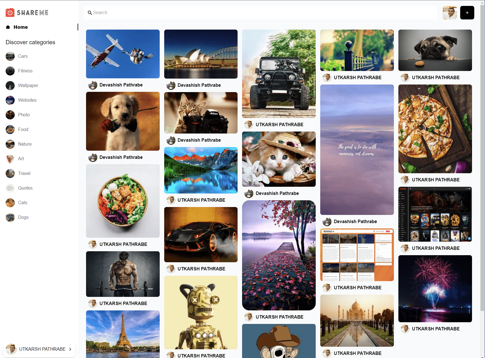

ShareMe
=======

[Live Website](https://utkarsh-pathrabe-shareme.netlify.app/)  

"ShareMe" stands as a comprehensive full-stack Social Media application tailored for photo sharing. With a robust feature set, it offers a rich user experience. Notable functionalities encompass Google Authentication for secure access. Users can create, edit, delete, and save posts, fostering content personalization. Interaction thrives through features like liking and commenting on fellow users' posts. The app supports effective image exploration through advanced search and filtering options. Crucially, "ShareMe" utilizes Sanity to adeptly manage data, ensuring seamless operations. By amalgamating these attributes, "ShareMe" becomes a versatile platform for social connectivity centered around visual storytelling.  

  

  

  
